# ReedSTYLE Development Workflow Process

## Ticket Lifecycle

```mermaid
graph LR
    A[📋 Planned] --> B[🔍 Analysis]
    B --> C[🚧 In Progress]
    C --> D[🧪 Testing]
    D --> E[📝 Documentation]
    E --> F[✓ Verification]
    F --> G[🔀 Commit]
    G --> H[✅ Done]
    
    D --> C[Fix Issues]
    F --> C[Fix Issues]
```



## 1. Ticket Creation Process

### Standard Ticket Template

Every ticket must follow this structure:

```markdown
# Ticket #XXX: [Title]

## Status: 📋 Planned | 🔍 Analysis | 🚧 In Progress | 🧪 Testing | ✅ Done

## Priority: 🔴 Critical | 🟠 High | 🟡 Medium | 🟢 Low

## Description
Clear, concise description of what needs to be implemented.

## Requirements
### Functional Requirements
- [ ] Requirement 1
- [ ] Requirement 2

### Technical Requirements
- [ ] Must follow namespace pattern
- [ ] CSS size impact < X KB
- [ ] JavaScript optional enhancement

## Implementation Plan
1. Step 1: [Specific action]
2. Step 2: [Specific action]
3. Step 3: [Specific action]

## Acceptance Criteria
- [ ] Feature works as specified
- [ ] Tests pass
- [ ] Documentation updated
- [ ] Code reviewed
- [ ] Performance verified

## Testing Checklist
- [ ] Unit tests written
- [ ] Integration tests pass
- [ ] Manual testing complete
- [ ] Browser compatibility verified
- [ ] Performance benchmarked

## Documentation Updates
- [ ] API documentation
- [ ] Usage examples
- [ ] Migration notes (if breaking)

## Dependencies
- Requires: #XXX, #YYY
- Blocks: #ZZZ

## Verification Steps
1. [ ] Code follows ReedSTYLE patterns
2. [ ] No breaking changes (unless major version)
3. [ ] File sizes within limits
4. [ ] Accessibility maintained

## Notes
Additional context, decisions, or concerns.
```

## 2. Implementation Workflow

### Phase 1: Analysis (🔍)

```bash
# 1. Switch to development branch
git checkout develop
git pull origin develop

# 2. Create feature branch
git checkout -b ticket-XXX-feature-name

# 3. Analyze existing code
grep -r "related-pattern" src/
find src/ -name "*.rs" | xargs grep "namespace"

# 4. Review documentation
cat docs/develop/XXX-related-doc.md

# 5. Update ticket status
# Status: 🔍 Analysis → 🚧 In Progress
```

### Phase 2: Implementation (🚧)

```bash
# 1. Write failing tests first (TDD)
cat > tests/ticket_XXX_test.rs << 'EOF'
#[test]
fn test_new_feature() {
    assert!(false, "Not implemented");
}
EOF

# 2. Run tests to confirm failure
cargo test ticket_XXX

# 3. Implement feature
vim src/namespaces/feature.rs

# 4. Run tests until passing
cargo test ticket_XXX

# 5. Check CSS output
cargo run --release
cat dist/reedstyle.css | grep "new-selector"

# 6. Verify file sizes
ls -lh dist/
# Ensure: CSS < 350KB, min.css < 180KB
```

### Phase 3: Testing (🧪)

```bash
# 1. Run all tests
cargo test

# 2. Type check TypeScript
npm run type-check

# 3. Test CSS generation
cargo run --release -- --test

# 4. Create test HTML
cat > test-ticket-XXX.html << 'EOF'
<!DOCTYPE html>
<html>
<head>
  <link rel="stylesheet" href="dist/reedstyle.css">
  <script src="dist/reedstyle.js" defer></script>
</head>
<body>
  <!-- Test new feature -->
  <reed as="test" new-feature="value">
    Test content
  </reed>
</body>
</html>
EOF

# 5. Serve and test manually
python3 -m http.server 8000

# 6. Test in browsers
# - Chrome/Edge latest
# - Firefox latest
# - Safari latest
# - Mobile browsers
```

### Phase 4: Documentation (📝)

```bash
# 1. Update main documentation
vim docs/develop/XXX-namespace.md

# 2. Add usage examples
cat >> docs/develop/XXX-namespace.md << 'EOF'
### New Feature Name

\```html
<reed as="example" namespace="[property:value]">
  Example usage
</reed>
\```
EOF

# 3. Update changelog
cat >> CHANGELOG.md << 'EOF'
## [Unreleased]
### Added
- Ticket #XXX: New feature description
EOF

# 4. Generate API docs
npm run docs
```

### Phase 5: Verification (✓)

#### Logic Verification Checklist

```rust
// src/namespaces/feature.rs

// ✓ 1. Namespace follows pattern
pub fn generate(config: &Config) -> String {
    let mut css = String::new();
    
    // ✓ 2. Uses reed selector
    css.push_str(r#"reed[namespace*="property:value"] {"#);
    
    // ✓ 3. Respects configuration
    if config.features.enabled {
        // ✓ 4. Generates valid CSS
        css.push_str("  property: value;\n");
    }
    
    css.push_str("}\n");
    
    // ✓ 5. Includes responsive variants
    for breakpoint in BREAKPOINTS {
        css.push_str(&generate_responsive(breakpoint));
    }
    
    css
}

// ✓ 6. Has tests
#[test]
fn test_generate() {
    let config = test_config();
    let css = generate(&config);
    
    // ✓ 7. Verify output
    assert!(css.contains("reed["));
    assert!(!css.contains("undefined"));
    assert!(!css.contains("null"));
}
```

#### CSS Verification

```css
/* ✓ 1. Follows layer system */
@layer theme {
  /* ✓ 2. Uses CSS variables */
  reed[namespace*="property"] {
    /* ✓ 3. Valid CSS properties */
    property: var(--reedstyle-value);
    
    /* ✓ 4. Vendor prefixes if needed */
    -webkit-property: value;
    
    /* ✓ 5. Fallbacks for older browsers */
    property: fallback-value;
    property: modern-value;
  }
}

/* ✓ 6. Responsive variants */
@media (min-width: 560px) {
  reed[namespace-tablet*="property"] {
    property: value;
  }
}

/* ✓ 7. Respects reduced motion */
@media (prefers-reduced-motion: reduce) {
  reed[namespace*="animate"] {
    animation: none !important;
  }
}
```

#### JavaScript Verification

```javascript
// ✓ 1. Optional enhancement only
if (typeof document !== 'undefined') {
  // ✓ 2. Feature detection
  if ('customElements' in window) {
    // ✓ 3. Progressive enhancement
    class Enhancement {
      constructor(element) {
        // ✓ 4. Null checks
        if (!element) return;
        
        // ✓ 5. Attribute validation
        const attr = element.getAttribute('namespace');
        if (!attr) return;
        
        // ✓ 6. Error handling
        try {
          this.enhance(element);
        } catch (error) {
          console.warn('Enhancement failed:', error);
        }
      }
    }
    
    // ✓ 7. Performance conscious
    requestIdleCallback(() => {
      document.querySelectorAll('reed').forEach(el => {
        new Enhancement(el);
      });
    });
  }
}
```

### Phase 6: Commit Process (🔀)

```bash
# 1. Review all changes
git status
git diff

# 2. Run final tests
cargo test && npm run type-check

# 3. Stage files
git add src/namespaces/feature.rs
git add tests/ticket_XXX_test.rs
git add docs/develop/XXX-namespace.md

# 4. Commit with ticket reference
git commit -m "feat: Implement [feature name] (#XXX)

- Add new namespace property
- Generate responsive variants
- Include documentation
- Add comprehensive tests

Closes #XXX"

# 5. Push feature branch
git push origin ticket-XXX-feature-name

# 6. Create Pull Request
gh pr create --title "Ticket #XXX: [Feature Name]" \
  --body "## Changes
- Implements feature as specified in #XXX
- Adds tests and documentation
- File size impact: +X KB

## Testing
- [x] All tests pass
- [x] Manual testing complete
- [x] Documentation updated

## Checklist
- [x] Code follows patterns
- [x] No breaking changes
- [x] Performance verified"

# 7. After review and merge
git checkout develop
git pull origin develop
git branch -d ticket-XXX-feature-name
```

## 3. Verification Matrix

| Component | Verification Steps | Tools | Pass Criteria |
|-----------|-------------------|-------|---------------|
| **Rust Code** | 1. Compile check<br>2. Unit tests<br>3. Integration tests | `cargo build`<br>`cargo test`<br>`cargo clippy` | No errors<br>All tests pass<br>No warnings |
| **CSS Output** | 1. Valid syntax<br>2. Size check<br>3. Selector verification | `lightningcss`<br>`ls -lh`<br>`grep` | Valid CSS<br><180KB min<br>Uses `reed[` |
| **JavaScript** | 1. Type check<br>2. Syntax check<br>3. Runtime test | `tsc --noEmit`<br>`node -c`<br>Browser console | No type errors<br>Valid syntax<br>No runtime errors |
| **Documentation** | 1. Markdown lint<br>2. Example validation<br>3. Link check | `markdownlint`<br>Manual test<br>`linkcheck` | Valid markdown<br>Examples work<br>No broken links |
| **Performance** | 1. Build time<br>2. File size<br>3. Runtime perf | `time cargo run`<br>`du -h dist/`<br>DevTools | <500ms<br><200KB CSS<br>60fps animations |

## 4. Status Tracking

### Ticket Status Dashboard

```markdown
## Current Sprint

### 🔴 Critical (Blockers)
- [ ] #906 - Rust Build System Core

### 🟠 High Priority
- [ ] #907 - Namespace CSS Generation
- [ ] #909 - Lightning CSS Integration

### 🟡 Medium Priority
- [ ] #916 - Typography Engine
- [ ] #917 - Effects System

### 🟢 Low Priority
- [ ] #941 - Distribution Strategy
- [ ] #942 - CI/CD Pipeline

### Status Legend
- 📋 Planned - Not started
- 🔍 Analysis - Research phase
- 🚧 In Progress - Active development
- 🧪 Testing - QA phase
- 📝 Documentation - Docs update
- ✓ Verification - Final checks
- 🔀 Review - PR review
- ✅ Done - Completed
```

## 5. Quality Gates

Before marking a ticket as Done:

### Code Quality
- [ ] Follows ReedSTYLE patterns
- [ ] No console errors/warnings
- [ ] No TypeScript errors
- [ ] Passes linting

### Testing
- [ ] Unit tests: 100% of new code
- [ ] Integration tests: Key paths
- [ ] Manual testing: All browsers
- [ ] Performance: Within budgets

### Documentation
- [ ] API documented
- [ ] Examples provided
- [ ] Changelog updated
- [ ] Migration guide (if breaking)

### Review
- [ ] Self-review complete
- [ ] Peer review approved
- [ ] Tested by reviewer
- [ ] Approved for merge

## 6. Rollback Procedure

If issues found after merge:

```bash
# 1. Identify problem commit
git log --oneline -10

# 2. Create hotfix branch
git checkout -b hotfix-XXX

# 3. Revert problematic commit
git revert <commit-hash>

# 4. Test thoroughly
cargo test && npm test

# 5. Fast-track merge
git push origin hotfix-XXX
gh pr create --title "Hotfix: Revert #XXX" --label "hotfix"

# 6. Or rollback release
git tag -d v1.0.1
git push origin :refs/tags/v1.0.1
```

## 7. Communication

### Ticket Updates

```markdown
## Update Template

**Status Update - [Date]**
- Status: 🔍 Analysis → 🚧 In Progress
- Progress: Implemented base functionality
- Blockers: None
- Next: Add tests and documentation
- ETA: 2 days
```

### Completion Report

```markdown
## Ticket #XXX Completion Report

**Summary**
- Feature implemented as specified
- All tests passing
- Documentation complete

**Impact**
- CSS size: +2KB (minified)
- JS size: No change
- Breaking changes: None

**Testing**
- Unit tests: 12 added
- Manual testing: Chrome, Firefox, Safari
- Performance: No regression

**Files Changed**
- src/namespaces/feature.rs
- tests/feature_test.rs
- docs/develop/105-fx.md

**Commit**: abc123def
**PR**: #456
**Merged**: 2024-01-15
```

## Best Practices

1. **One Ticket, One Feature** - Keep scope focused
2. **Test First** - Write tests before implementation
3. **Document as You Go** - Update docs with code
4. **Commit Often** - Small, logical commits
5. **Review Thoroughly** - Quality over speed
6. **Verify Everything** - Trust but verify
7. **Communicate Progress** - Update ticket status daily